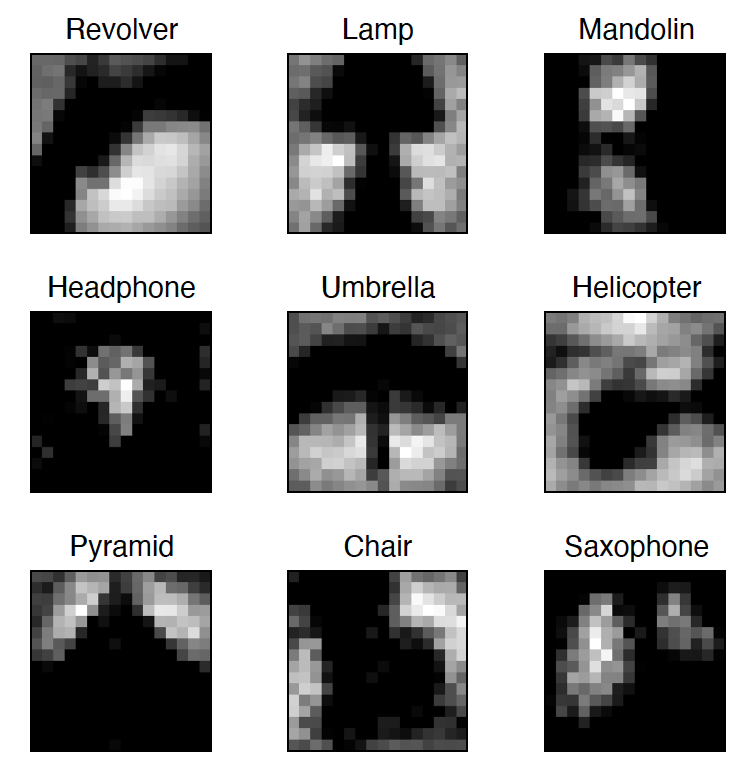
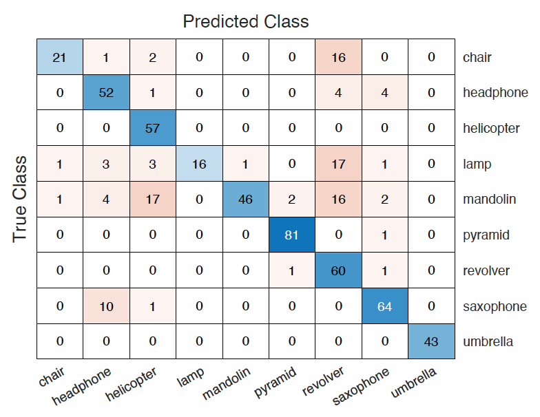

# Leveraging autocatalytic reactions for chemical-domain image classification

[](http://creativecommons.org/licenses/by-nc/4.0/)


MATLAB code for training and simulating the chemical-based image classification network detailed in our paper:

"Leveraging autocatalytic reactions for chemical-domain image classification" by Christopher E. Arcadia, Amanda Dombroski, Kady Oakley, Shui Ling Chen, Hokchhay Tann, Christopher Rose, Eunsuk Kim, Sherief Reda, Brenda M. Rubenstein, and Jacob K. Rosenstein. Chem. Sci. (2021).
https://doi.org/10.1039/D0SC05860B


## Requirements
To run this code, the following are required:
* [MATLAB](https://www.mathworks.com/products/matlab.html) (tested and developed on [R2020b](https://www.mathworks.com/products/new_products/latest_features.html))
* [CalTech 101 Silhouettes](https://people.cs.umass.edu/~marlin/data.shtml#:~:text=Description%3A%20This%20is%20a%20new,primary%20object%20in%20the%20scene.&text=The%20outline%20is%20rendered%20as,polygon%20on%20a%20white%20background) Data Set (download the [16x16 version](https://people.cs.umass.edu/~marlin/data/caltech101_silhouettes_16.mat))


## Usage

1. Download the CalTech 101 data set 

2. update the field `database_path` in the `configure_options.m` file with the database location.

3. Review and optionally edit the other program settings in the `configure_options.m` file.

4. Run the script `main.m` in MATLAB to train and simulate the network.

Also included is a script to analyze the images in the provided dataset (`analyze_dataset.m`) as well as a script to run multiple classification tests (`test_multiple_classifiers.m`).

## Example

Running the `main.m` script, after changing the default classes and epoch count to:

```matlab
option.classes = {'revolver','lamp','mandolin','headphone','umbrella','helicopter','pyramid','chair','saxophone'};
option.epochs = 900; 
```

results in the following weight maps: 
<center></center>

and class predictions:
<center></center>

## Cite

Please cite our paper if you use this code in your own work:

```latex
@article{arcadia2021,
  author = {Arcadia, Christopher E and Dombroski, Amanda and Oakley, Kady and Chen, Shui Ling and Tann, Hokchhay and Rose, Christopher and Kim, Eunsuk and Reda, Sherief and Rubenstein, Brenda M and Rosenstein, Jacob K},
  title = {Leveraging autocatalytic reactions for chemical-domain image classification},
  journal = {Chem. Sci.},
  year = {2021},
  publisher = {The Royal Society of Chemistry},
  doi = {10.1039/D0SC05860B},
  url = {http://dx.doi.org/10.1039/D0SC05860B},
}
```

## Related Work

This work has been developed by the [Molecular Informatics Team](https://molecularcomputing.info/) at [Brown University](https://www.brown.edu/) (Providence, RI, USA). Visit our website for related [projects](https://molecularcomputing.info/research/) and [publications](https://molecularcomputing.info/publications/). 

## License

Copyright &copy; 2021, Christopher E. Arcadia

This work is licensed under a Creative Commons Attribution-NonCommercial 4.0 International License ([CC BY-NC 4.0](http://creativecommons.org/licenses/by-nc/4.0/)).

